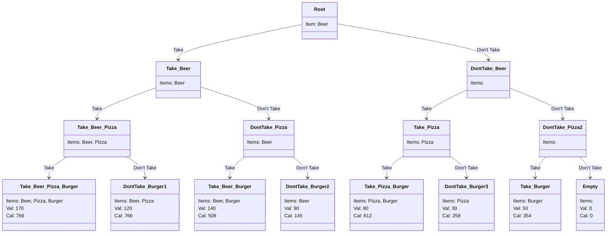
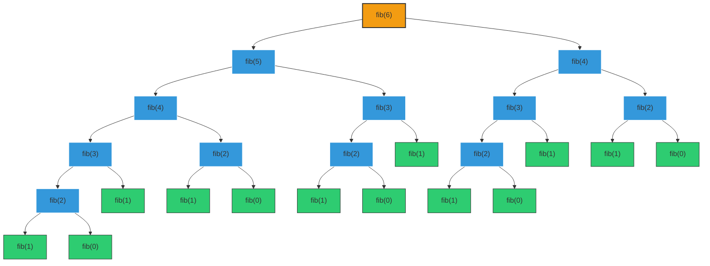
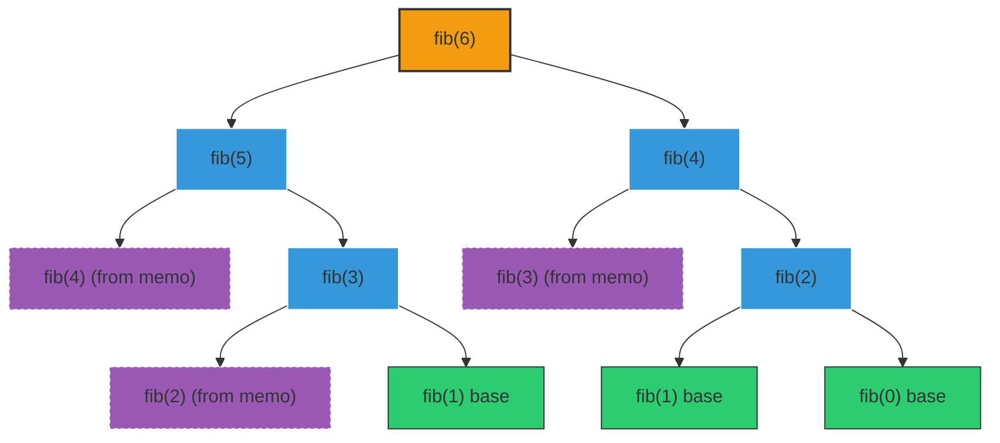
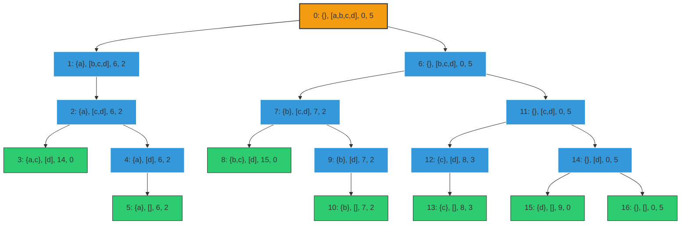

# Lecture 2 - Optimization Problems

In this lecture we will have an intro to dynamic programming and some application of the process.

## Greedy algorithms

While greedy algorithms are easy to implement and really efficient computationally, they do not always yeld the best solution and it does not even know how good the approximation is.

So far we've check a **brute force algorithm** that:

1. Enumerates all possible combination of items.

2. Remove all of the combinations whose total units exceeds the allowed weight (calories in our case).

3. From the remaining combination, chose the largest value.

We can check a better solution to find truly optimal solutions using search tree.

## What is a Search Tree?

What is a search tree? A tree is basically a kind of **graph** where we have a root and then children of the root. We look the list of elements to be considered for the choice, elements that we might taken and we look at the first element of this list and then we draw a left branch which shows the consequence of choosing that element and the right branch is the consequences of **not** taking the element. We do this until we get to the bottom of the tree. The **leaf** children is where there are no more elements to be considered.

Finally we choose the **node** that has the highest values that meets our expectations.

In our example we have a backpack that can hold a certain number of calories and we are choosing between a beer, a pizza and a burger.

> First thing to explore on the left branch: We take the beer, then we have the pizza and the burger left to consider

> Then we say, let's take the pizza, now we have just the burger...

> Now we take the burger...



The traversal generation of the tree is called **left-most depth-most**, we go all the way down to the bottom of the tree. Notice that the **leftmost** leaf of this tree has got all the possible items in it, while the **rightmost** leaf has none.

With a calorie restriction of 750, we can choose the winner which is: The burger and the pizza, which is the only choice with most value under 750.

## Computational Complexity

The time is based on the numbers we generated, so if we know the number of nodes that are in the tree, we know the complexity of the algorithm.

But how many levels do we have? We can check that it's just the number of items, because at each level of the tree we are deciding whether to take an item or not. Since we can only do that for the number of items we have, if we count the number of levels it's going to be **based upon the total number of items**. 

How many nodes do we have at each level? We can check that the deeper we go, the more nodes we have at each level: 1, 2, 4, 8...

We can conclude that:

1. Number of levels is number of items to choose from
2. Number of nodes at level $i$ is $2^i$

If we have $n$ items to choose from, the number of possible choices is $2^n$ which is the size of the **power set**.

To check the complexity, if there are $n$ items the number of *nodes* is:

$$ \Sigma_{i = 0}^{i = n} 2^i $$

Which is equal to $O(2^{n + 1})$

What an obvious optimization would be? Well, we don't need to explore the whole tree, for instance: we can ignore parts of tree that violates our restriction (more calories than we are allowed to). Although it is a nice optimization, it won't change the complexity because it does not change the worst-cost complexity.

Brute force implementation:

```py
def maxVal(toConsider, avail):
    """Assumes toConsider a list of items, avail a weight
       Returns a tuple of the total value of a solution to the
         0/1 knapsack problem and the items of that solution"""
    if toConsider == [] or avail == 0:
        result = (0, ())

    elif toConsider[0].getCost() > avail:
        #Explore right branch only
        result = maxVal(toConsider[1:], avail)

    else:
        nextItem = toConsider[0]

        #Explore left branch
        withVal, withToTake = maxVal(toConsider[1:],
                                     avail - nextItem.getCost())
        withVal += nextItem.getValue()

        #Explore right branch
        withoutVal, withoutToTake = maxVal(toConsider[1:], avail)

        #Choose better branch
        if withVal > withoutVal:
            result = (withVal, withToTake + (nextItem,))
        else:
            result = (withoutVal, withoutToTake)

    return result
```

Where ```avail``` is an index which we'll use to go through the list using it to tell us whether or not we still have an element to consider. The result will be the tuple 0 and the empty tuple. Meaning that we could not take anything, which is the base of our recursion: Either there's nothing left to consider or there's no available weight (the ```avail``` as the amount of weight is $0$ or ```toConsider``` is empty).

If either of those are true, then we ask to consider $0$ (the first element we look at). Is this cost greater than availability? If yes, we explore only the **right branch**, meaning we don't need to explore the **left branch** because we can't afford to put this item in the backpack. Then the ```result``` will be the whatever maximum value is of ```toConsider``` of the remainder of the list (the list with the first element sliced off: ```toConsider[1:]```) and availability unchanged. This recursive implementation is saying basically that we only need to consider the **right branch** of the tree because we knew we couldn't take this element whether because it's weights too much, or costs too much.

Otherwise we have to consider both branches (left and right), setting ```toConsider``` of zero the first one, and explore the **left branch**. On this branch there are two possibilities which are called ```withVal``` and ```withToTake```. So we call ```maxValue``` of ```toConsider``` of everything except the current element and pass in an available weight of avail minus the cost of the next item:

```py
withVal, withToTake = maxVal(toConsider[1:], avail - nextItem.getCost())
```

Then, we will add to ```withVal``` ```nextItem.getValue()```, meaning it will be the value if we take it.

Now exploring the **right branch** (what happens if we don't take it?). After we'll choose the better branch.

This recursive algorithm go all the way to the bottom, then make the right choice at the bottom of the tree, then filter back up.

## Dynamic Programming

To understand it, let's look at Fibonacci numbers because it grows really fast:

```py
def fib(n):
    if n == 0 or n == 1:
        return 1
    else:
        return fib(n -1) + fib (n - 2)
```

What's the issue with this algorithm? Well, if we choose any value for n, let's say $n = 30$, it will mean that each time we are calculating ```fib(n)``` it has to go thru all the steps it had already calculate. For instance, if we calculate ```fib(19)```, when performing the calculations for ```fib(20)``` the algorithm would need to go from $1$ to $20$ all over again. Let's take a look at a tree for this algorithm until ```fib(6)```: (note the green leaves are the base cases (0 and 1) and the blue internal nodes are the recursive calls)



We can notice that it's repeating a lot of calculations, example: ```fib(4)``` is being computed 2 times, ```fib(3)``` 3 times, and it goes on. Since the answer for ```fib(3)``` is always the same, we are performing unnecessary calculations. How could we avoid doing the same work over and over again? Let's say, what if we could calculate ```fib(3)``` once and if this value is needed again, we could simply call it? We could simply store the answer of ```fib(3)``` and just look it up when needed.

We compute ```fib(3)```, store it and we would never have to compute it again. *Dictionaries* are good when implementing this kind of algorithm because we can look things up really quickly, almost in a constant time.

This concept is called **memoization** is the heart of dynamic programming. As we create a memo and we store it in the memo. What memoization really does is trade time for space, because it takes some space to store the old results. This can be achieved by:

    Create a table to record what we've computed:
        1. Before computing fib(n), check if value of fib(n) is already stored in the table
            - If yes, look it up
            - If not, compute it and then add it to the table

So a fast implementation for Fibonacci using the memoization concept can be like:

```py
def fastFib(n, memo = {}):
    ''' n is an integer and n > 0, 
    memo is the dictionary that stores every fib(n) calculated, only used by recursive calls
    return Fibonacci of n'''
    if n == 0 or n == 1:
        return 1
    try:
        return memo[n]
    except KeyError:
        result = fastFib(n - 1, memo) + fastFib(n - 2, memo)
        memo[n] = result

        return result
```

The extra argument ```memo``` is a dictionary where we'll store every calculated value for ```fib(n)```. The first time we call it, the memo will be empty and it will try to return the value in the memo, if it's not there then an exception will be raised, but it will branch to the second part, in which ```fib(n)``` is computed and the value of it is immediately stored in ```memo```.

We can use exceptions not as an error handling tool, but as a flow control, which makes the code cleaner than using a lot of if/else's.

Looking at the diagram for this version, we can clearly see it's faster:



Where:

    Orange root where we are starting call fib(6).

    Blue leaves are the recursive expansions actually performed.

    Green leaves are the base cases (fib(1), fib(0)).

    Purple leaves are the values fetched from memo instead of recalculated.

### When to use dynamic programming? 

Dynamic Programming cannot solve all kind of problems, but the problems it can, it finds an **optimal solution** instead of an **approximation**. But it can solve problems that have two things:

1. **Optimal Substructure**
    A globally optimal solution can be found by combining optimal solutions to local problems, for instance in the Fibonacci problem:
    - For x > 1, fib(x) = fib(x - 1) + fib(x - 2)

2. **Overlapping Subproblems**
    Finding an optimal solution involves solving the same problem multiple times, for instance in the Fibonacci problem where:
    - Computing fib(n) n times

What about the backpack problem? It does have optimal substructure because we are taking the left branch and the right branch then choosing the winner. But does it have overlapping subproblems? Are we ever solving the same problem in two nodes? The answer is no for the overlapping subproblems.

So we could write a dynamic solution for this problem, but we would get **zero** optimization from it, because at each node the problems are different. We have different items in the backpack or different items to consider, we never do the same contents and the same items left to decide.

## Implementing the Backpack problem with Dynamic Programming

Let's build a small menu:

| Item | Value | Calories |
|:----:|:-----:|:--------:|
|  a   |   6   |    3     |
|  b   |   7   |    3     |
|  c   |   8   |    2     | 
|  d   |   9   |    5     |

And let's build a search tree, where each node = <taken, left, value, remaining calories>



We can check that each node in this tree starts with what we've taken. Initially the empty set as we haven't taken anything yet, what's left, the total value and the remaining calories. 

When asked if we are solving the same issue, we don't care what we have already ```taken```, we also don't care about the ```value```, all we care is how much space we have left in the backpack (or calories in our case) ```remaining calories``` and which items are ```left``` to consider. That's because what we take next or what we take remaining has nothing to do with how much value there are in the backpack, because we are trying to **maximize** the values that's left.

We also don't care why we have 100 calories left, because if we used it up on pizzas or burger, the only thing that matters is that we have just 100 left.

Hence, we can see that in a larger, more complicated problem, it could easily lead to a situation where we have the same number of remaining calories. Thus, we are solving a problem we've already solved.

So at each node, we're just given the remaining weight (calories), maximize the value by choosing among the remaining items. Then we have overlapping subproblems.

How do we modify the ```maxVal``` to use a memo?

1. First of all, we need to add memo as a third argument:
    ```def fastMaxVal(toConsider, avail, memo = {})```

2. Key of memo is a tuple:
    - items left to be considered, available weight
    - items left to be considered represented by ```len(toConsider)```

Run the algorithm from example, but we can see that using the memo it's way faster as len(items) increases.

Quickly summarization:

- Many problems can be formulated as **optimization problems**

- **Greedy Algorithms** often provides adequate solutions (not necessary optimal)

- Finding an *optimal solution* is usually **exponentially hard**

- **Dynamic Programming** often yields good performance for a subclass of optimization problems, where the solutions are always correct and it's fast under the right circumstances.

## Exercises and Problems:

Optimization Problems Exercises

1. Activity Selection Problem - Completed on 04th September 2025

    - You are given $n$ activities with start and finish times.

    - Select the maximum number of activities that don’t overlap.

    - Approach: Sort by finishing times and apply greedy selection.

    - Dataset with activities and start and finish:

    | Activity | Start | Finish |
    |:--------:|:-----:|:------:|
    |    A1    |   1   |   4    |
    |    A2    |   3   |   5    |
    |    A3    |   0   |   6    |
    |    A4    |   5   |   7    |
    |    A5    |   3   |   9    |
    |    A6    |   5   |   9    |
    |    A7    |   6   |   10   |
    |    A8    |   8   |   11   |
    |    A9    |   8   |   12   |
    |    A10   |   2   |   14   |


2. Fractional Knapsack

    - Each item has a weight and a value.

    - You can take fractions of items.

    - Maximize the value for a given weight limit.

    - Approach: Greedy by highest value/weight ratio.

3. Coin Change (Minimum Coins, Greedy version)

    - Given coin denominations ```{1, 5, 10, 25}``` and an amount $N$,

    - Find the minimum number of coins to make $N$.

    - Approach: Greedy works when the coin system is canonical (like U.S. coins).

4. Huffman Coding

    - Given frequencies of characters, build a prefix-free binary code.

    - Approach: Greedy algorithm using a min-heap.

5. Interval Scheduling with Deadlines

    - Given jobs with deadlines and profits, select the subset of jobs that maximizes profit while meeting deadlines.

    - Approach: Greedy by sorting on profit and scheduling backwards.

**Dynamic Programming Exercises**

6. 0/1 Knapsack Problem

    - Already solved with calories and values.

    - Variation: Add a constraint on the number of items, or consider two dimensions (weight and calories).

7. Coin Change (Number of Ways, DP version)

    - Given coin denominations and a target $N$,

    - Find how many ways to make change for $N$.

    - Approach: Use DP with overlapping subproblems.

8. Longest Increasing Subsequence (LIS)

    - Given a sequence of numbers,

    - Find the length of the longest subsequence that is strictly increasing.

    - Approach: DP with optimal substructure.

9. Matrix Chain Multiplication

    - Given a sequence of matrices,

    - Find the minimum number of scalar multiplications needed to multiply them all.

    - Approach: DP with parenthesization choices.

10. Rod Cutting Problem

    - Given a rod of length $n$ and a table of prices for each piece length,

    - Determine the maximum revenue obtainable by cutting up the rod.

    - Approach: DP with optimal substructure.

11. Subset Sum / Partition Problem

    - Given a set of integers,

    - Decide if it can be partitioned into two subsets with equal sum.

    - Approach: DP with boolean states.

12. Fibonacci Numbers with Memoization

    - Classic example of overlapping subproblems.

    - Variation: Count the number of ways to climb n stairs if you can take 1 or 2 steps at a time.

