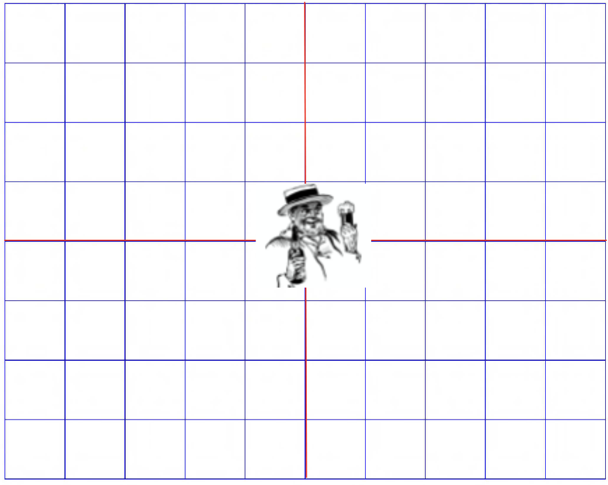
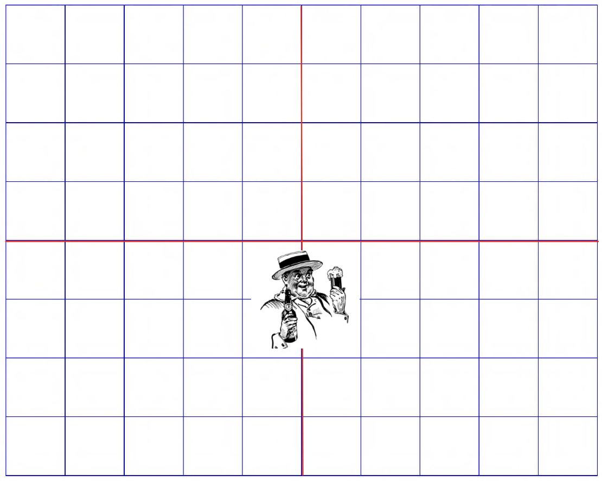
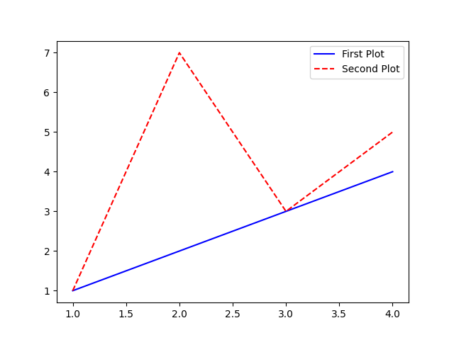
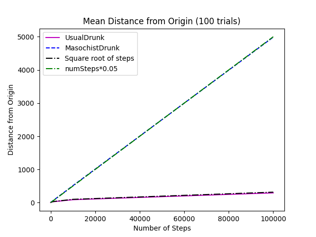

# Lecture 5 - Random Walks

How to build simulations and plot graphs in Python.

#### Content

- [What are random walks](#what-are-random-walks)
- [The Drunkard's Walk](#the-drunkards-walk)
- [Simulating a Random Walk](#simulating-a-random-walk)
[Abstraction of `Location`](#abstraction-of-location)
[Abstraction of `Drunk` - Base Class](#abstraction-of-drunk---base-class)
[Abstraction of `normalDrunk` - Subclass of `Drunk`](#abstraction-of-normaldrunk---subclass-of-drunk)
[Abstraction of `masochistDrunk` - Subclass of `Drunk`](#abstraction-of-masochistdrunk---subclass-of-drunk)
- [Testing the Simulation](#testing-the-simulation)
- [Plotting in Python](#plotting-in-python)
- [Plotting the Drunkard's Distance Trends](#plotting-the-drunkards-distance-trends)
- [Plotting the Endpoints](#plotting-the-endpoints)
- [Outcomes for this Lecture](#outcomes-for-this-lecture)

## What are Random Walks

Random walks are important for modeling complex systems by simulating processes like understand the stock market. It's also important when modeling diffusion processes (the random motion of molecules, heat diffusion) that applies to fields like mathematical models describing random motion. It helps to understand **phenomena with inherent randomness**.

**Brown Motion** is an example of a random walk. We are going to look into random walks for three major reasons:

1. They are intrinsically interesting and widely used

2. It provides us good example of how to use abstract data types (such as Graphs) and inheritance to structure programs in general, (in particular **simulation models**)

3. An opportunity to learn more Python features and demonstrate techniques like **plotting**.

## The Drunkard's Walk

Imagine a drunken farmer standing in the middle of a field, and every second the farmer takes on step in a random direction. Is there any interesting relationship between the number of steps the drunk takes and how far he gets from the origin at the end of those steps? We can imagine that since it's **random**, he just wanders away and he wanders back in all directions, and more or less he never gets very far.



One possible first step he can make:



Another possible first step:


But let's take a look at the possible distances after **two steps** for instance:


I think does not matter how many steps, he'll be more or less the same distance away.

## Simulating a random walk

How about after 100 000 steps? It would be difficult (and tedious) to go thru every single possible case. So we can use a **simulation** to sort this out. By structuring it as the follow: We will simulate one walk of `k` steps, `n` such walks and then report the *average distance* for the origin of `n` walks.

Let's define some useful abstractions first: Location (which is the field where our drunk is at), the Drunk himself.

### Abstraction of `Location`

Assumes `Location` to be a Cartesian plane `x` and `y`, Location will be an *immutable type*

```py
class Location(object):
    def __init__(self, x, y):
        """ x and y are floats """
        self.x = x
        self.y = y
    
    def move(self, deltaX, deltaY):
        """ deltaX and deltaY are floats """
        return Location(self.x + deltaX, self.y + deltaY)

    def getX(self):
        return self.x

    def getY(self):
        return self.y

    def distFrom(self, other):
        xDist = self.x - other.getX()
        yDist = self.y - other.getY()

        return (xDist**2 + yDist**2)**0.5

    def __str__(self):
        return '<' + str(self.x) + ', '\
                   + str(self.y) + '>'
```

It's immutable because `move` is not changing the location, it's returning a new location where it adds the change in x and in y to get two new *xy* values.

### Abstraction of `Drunk` - Base class

The `Drunk` abstraction will have a name and a string. It's not intended to be an useful class on it's own, this is what we call a **base class** where its only purpose is to be **inherited** for the two subclasses:

- The usual drunk: who wanders around at random
- The masochist drunk, who tries to move northward

```py
class Drunk(object):
    def __init__(self, name = None):
        """ Assumes name is a string """
        self.name = name
    
    def __str__(self):
        if self != None:
            return self.name
        return 'Anonymous Drunk.'
```

### Abstraction of `normalDrunk` - subclass of `Drunk`

The `normalDrunk` wanders at random one step, either increasing y (a step North), decreasing it (a step South), increasing x (a step East) or decreasing it (a step West). Don't forget to import the `random` module.

```py
class UsualDrunk(Drunk):
    def takeStep(self):
        stepChoices = [(0,1), (0,-1), (1,0), (-1, 0)]
        return random.choice(stepChoices)
```

### Abstraction of `MasochistDrunk` - subclass of `Drunk`

The `masochistDrunk` it's almost the same, but the choices are slightly different because if he chooses to head North, he doesn't go one step, he goes $1.1$ steps north. If he chooses to go South, then he only goes $9/10$ of a step. This is called a **biased random walk**, where the **bias** is the direction of the walk that he's moving either up or down.

```py
class MasochistDrunk(Drunk):
    def takeStep(self):
        stepChoices = [(0.0, 1.1), (0.0, -0.9)
                       (1.0, 0.0), (-1.0, 0.0)]
        return random.choice(stepChoices)
```

### Abstraction of `Field` - A collection of places and drunks

The `Field` class will have a dictionary to map a drunk to his/her location in the field called drunks, we also have the functions `addDrunk` which adds a drunk to the field. `getLoc` returns the drunk's location in the field and we can move the drunk around using the Location's move method in the following way:

```py
class Field(object):
    def __init__(self):
        self.drunks = {}

    def addDrunk(self, drunk, loc):
        if drunk in self.drunks:
            raise ValueError('Drunk already exists')
        else:
            self.drunks[drunk] = loc

    def getLoc(self, drunk):
        if drunk not in self.drunks:
            raise ValueError("Drunk is not in the field")
        
        return self.drunks[drunk]
    
    def moveDrunk(self, drunk):
        if drunk not in self.drunks:
            raise ValueError("Drunk is not in the field")
        
        xDist, yDist = drunk.takeStep()
        # use Location's move method to get new location
        self.drunks[drunk] = self.drunks[drunk].move(xDist, yDist)
```

## Testing the Simulation

We starting by defining a single walk as `walk()`, where the drunk will take some number of steps in the field. We get a loop where the drunk takes some number of random steps and we return the distance from the start to the final location.

```py
def walk(field, drunk, numSteps):
    """ Assumes: field and drunk in Field
    numSteps an int >= 0.
    Moves drunk numSteps times
    Returns: the distance between the final location and the location
    at the start of the walk. """

    start = field.getLoc(drunk)

    for step in range(numSteps):
        field.moveDrunk(drunk)
    
    return start.distFrom(field.getLoc(drunk))
```

We will need to simulate multiple walks now, where we got the number of steps, trials and which kind of drunk we want to simulate on. So we initialize our distance list as empty and we return a list for the amount of trials we do, the distances the drunk ended up from the origin.

```py
def simWalks(numSteps, numTrials, drunkClass):
    """ Assumes numSteps an int >= 0, numTrials and int > 0 and 
    dClass a subclass of Drunk.

    Simulates numTrials walks of numSteps steps each.
    
    Returns a list of the final distances for each trial. """

    Drunk1 = drunkClass()

    origin = Location(0, 0)
    distances = []

    for trial in range(numTrials):
        field = Field()
        field.addDrunk(Drunk1, origin)

        #distances.append(round(walk(field, Drunk1, numTrials), 1))
        distances.append(round(walk(field, Drunk1, numSteps), 1))

    return distances
```

We can finally test our simulation with `drunkTest` where we get all the distances traveled in each trial of `simWalks` and we can average that, look the mean, min or max.

```py
def drunkTest(walkLengths, numTrials, drunkClass):
    """ Assumes walkLengths is a sequence of ints >= 0
    numTrials an integer > 0
    drunkClass a subclass of Drunk
    
    For each number of steps in walkLengths, run simWalks with
    numTrials walks and print results """
    for numSteps in walkLengths:
        distances = simWalks(numSteps, numTrials, drunkClass)

        print(f"{drunkClass.__name__} random walk of {numSteps} steps")

        # Printing some statistics:
        print(f" Mean = {round(sum(distances)/len(distances), 4)}")
        print(f" Max = {max(distances)} and Min = {min(distances)}")
```

The `Mean` is the sum of all values in a dataset divided by the total number of values, this is the most common type of average. In our context, it represents the average distance our drunken walked given the steps. `Max` is the maximum distance the drunk walked from the origin and the `Min` the minimum distance walked.

Running the simulation for a usual drunk with walks from length: 10 steps, 100 steps, 1000 steps and 10000 steps, with 100 trials we got the following result:

```sh
$ python randomWalk()

UsualDrunk random walk of 10 steps
 Mean = 9.362
 Max = 31.0 and Min = 1.4

UsualDrunk random walk of 100 steps
 Mean = 8.849
 Max = 24.2 and Min = 1.4

UsualDrunk random walk of 1000 steps
 Mean = 9.392
 Max = 22.1 and Min = 1.4

UsualDrunk random walk of 10000 steps
 Mean = 9.56
 Max = 26.1 and Min = 1.4
```

Does these results look plausible? They're telling us that the length of the walk *does not affect how far the drunk gets*. We should always run **sanity checks** on our code, on know values so we can check whether our simulation is working properly or not. Taking a look on our code there was a problem in `distances.append(round(walk(field, Drunk1, numSteps), 1))` where it was passing the numTrials (which is constant). Fixing the code and running a sanity check:

```sh
Sanity check: (0 steps, 1 step, 2 steps)

$ python randomWalk.py

UsualDrunk random walk of 0 steps
 Mean = 0.0
 Max = 0.0 and Min = 0.0

UsualDrunk random walk of 1 steps
 Mean = 1.0
 Max = 1.0 and Min = 1.0

UsualDrunk random walk of 2 steps
 Mean = 1.0
 Max = 2.0 and Min = 0.0
```

Running the simulation again we get:

```sh
$ python randomWalk.py

UsualDrunk random walk of 10 steps
 Mean = 2.524
 Max = 8.0 and Min = 0.0

UsualDrunk random walk of 100 steps
 Mean = 8.743
 Max = 21.3 and Min = 0.0

UsualDrunk random walk of 1000 steps
 Mean = 28.73
 Max = 69.9 and Min = 5.1

UsualDrunk random walk of 10000 steps
 Mean = 86.346
 Max = 193.0 and Min = 11.0
```

It now appears to be the case that more steps our drunk takes, the more distant he'll be from the origin.

Running the simulation for a masochist drunk with walks from length: 10 steps, 100 steps, 1000 steps and 10000 steps, with 100 trials we got the following result:

```sh
$ python randomWalk.py

MasochistDrunk random walk of 10 steps
 Mean = 2.967
 Max = 6.4 and Min = 0.2

MasochistDrunk random walk of 100 steps
 Mean = 9.758
 Max = 21.9 and Min = 1.0

MasochistDrunk random walk of 1000 steps
 Mean = 57.745
 Max = 136.3 and Min = 6.1

MasochistDrunk random walk of 10000 steps
 Mean = 500.369
 Max = 684.7 and Min = 338.3
```

What if we a simulation to compare the usual drunk to the masochist one?

```py
def simAll(drunkKinds, walkLengths, numTrials):
    for dClass in drunkKinds:
        drunkTest(walkLengths, numTrials, dClass)
```

Running the simulation for all kinds of drunks: (with no seed(0))

```sh
$ python randomWalk.py

UsualDrunk random walk of 1000 steps
 Mean = 26.937
 Max = 82.4 and Min = 2.8

UsualDrunk random walk of 10000 steps
 Mean = 83.88
 Max = 202.0 and Min = 12.2

MasochistDrunk random walk of 1000 steps
 Mean = 56.522
 Max = 128.9 and Min = 4.5

MasochistDrunk random walk of 10000 steps
 Mean = 506.025
 Max = 728.9 and Min = 309.3
```

We can totally see that the masochist drunk is making more progress than the usual drunk, here our bias appear to be changing the distance, but why? So we need to visualize the **trend** by plotting the results.

## Plotting in Python

We are going to use `Pylab`, where it combines other libraries to provide a MATLAB like interface. The following libraries are really useful in Python:

- [`NumPy`](https://numpy.org/) adds Vectors, Matrices and a lot of high-level mathematical functions.

- [`SciPy`](https://scipy.org/) adds mathematical classes and functions useful to Scientists.

- [`MatPlotLib`](https://matplotlib.org/) adds an objected-oriented API for *plotting*.

The `plot` command to print graphs plots points in order. It takes two arguments (third one is optional):

```py
>>> plot('xlabel', 'ylabel', data=obj)
```

Making a plot:

```py
import pylab

xValues = [1, 2, 3, 4]
yValues1 = [1, 2, 3, 4]
yValues2 = [1, 7, 3, 5]

pylab.plot(xValues, yValues1, 'b-', label = 'First Plot')
pylab.plot(xValues, yValues2, 'r--', label = 'Second Plot')
pylab.legend()

pylab.show()
```

Will produce the following plot:



## Plotting the Drunkard's Distance Trends

Now getting back to the Drunkard's Problem, we want to visualize the **trend** by plotting the results of each walk, which we can do by changing the simulation to plot (check it at [randomWalkwithPlot.py](/Lecture%20Codes/Lecture%205/randomWalkwithPlot.py)), which generates the following plot:



## Plotting the Endpoints

We can also plot the endpoints for each drunkard to check their final location on each walk simulation running the simulation at [finalLocation.py](/Lecture%20Codes/Lecture%205/finalLocation.py)

## Outcomes for this Lecture

The main point of this lecture was how we build up simulations in Python and how we can use them to model the real world and draw some conclusions for it, which is a huge step into our premise of using computer to solve real world problems. When working with simulation models is important to get a simple version of it working first, so we can do sanity checks to ensure our simulation is working as expected before we can use it to gather useful data.