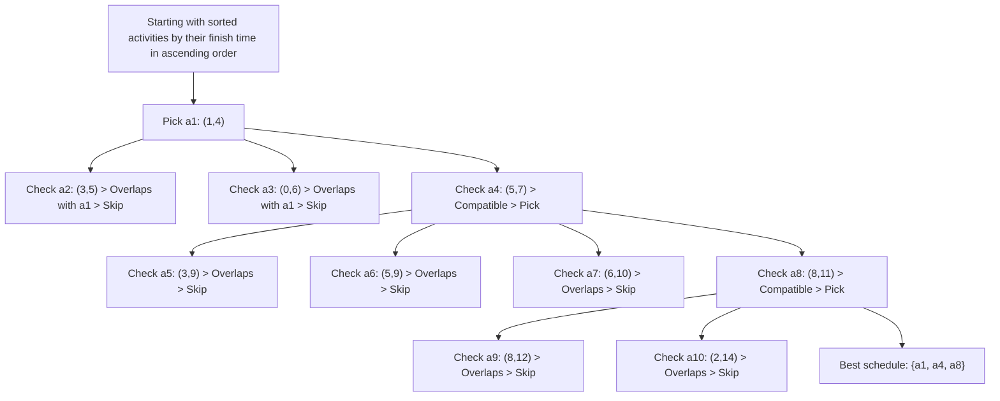

# Problem 1 - Activity Selection Problem

    Solution by Victor Correa
    Time spend on this activity: 2 hours and 47 minutes
    Completed on 04th September 2025

You are given a list of $n$ activities, each with a start time and a finish time. Two activities are said to be **compatible** if they do not overlap in time. You can do only one activity at a time.

Select the maximum number of non-overlapping activities. Think of it like scheduling talks at a conference where you want to attend as many as possible, but you can’t be in two talks at the same time.

Bear in mind that:

- Earliest finish time is often more useful than earliest start time. Why? 
    > Because finishing earlier leaves more room for other activities later.

Some useful **hints** for solving this activity:

- Sorting helps, so the order in which you consider activities matters a lot.

- Earliest finish time is often more useful than earliest start time. Why? Because finishing earlier leaves more room for other activities later.

- Greedy choice property: If you always make the "locally best" choice (for instance, pick the next activity that ends the soonest and doesn’t overlap with any other), you can still end up with the optimal solution.

- Optimal substructure: After you pick one activity, the problem reduces to a smaller version of itself with only the activities that start after that one finishes. That's where sort is handy, by sorting the list with the earlier finish first, we can pick this up and reduce the problem with the activities with greater finish time.

## Approach

By sorting the activity list by finishing time, I can apply a greedy selection to check what is the best schedule for the activities that don't overlap. Consider the following activity dataset which contains each activity's name, start and finish time: (Here I'm keeping it simple for easiest implementation)

| Activity | Start | Finish |
|:--------:|:-----:|:------:|
|    A1    |   1   |   4    |
|    A2    |   3   |   5    |
|    A3    |   0   |   6    |
|    A4    |   5   |   7    |
|    A5    |   3   |   9    |
|    A6    |   5   |   9    |
|    A7    |   6   |   10   |
|    A8    |   8   |   11   |
|    A9    |   8   |   12   |
|    A10   |   2   |   14   |

## Define the Class Activity

I can start by defining a class ```Activity``` that will ensure me a clean, structured objects instead of raw lists, which will make my code easier to debug when needed. A few getter methods which will help me fetch data from this object is also defined here: ```getName``` will get the activity's name, ```getStart``` and ```getFinish``` will get the start and finish time for each activity.

```py
class Activity(object):
    def __init__(self, act, start, finish):
        self.activity = act
        self.start = start
        self.finish = finish

    # Getters Methods
    def getName(self):
        return self.activity
    
    def getStart(self):
        return self.start
    
    def getFinish(self):
        return self.finish
    
    # Object Representation
    def __str__(self):
        return 'Activity: ' + self.activity + ': (start: ' + str(self.start)\
                + ', finish: ' + str(self.finish) + ')'

    def __repr__(self):
        return self.__str__()
```

## Define the Build Dataset Function

Now I can define a function to build my activity's dataset object with the activities names, start and finish times.

```py
def buildActivityDataset(activity, start, finish):
    """ Assumes activity, start and finish are lists
    returns Activity object : a list of each activity containing:
    (activity, start, finish) """
    dataset = []

    for i in range(len(start)):
        dataset.append(Activity(activity[i], start[i], finish[i]))

    return dataset
```

## Define the Sort Function

After performing some tests for sorting order (increasing, decresing), I decided to go with sorting activities by their finish times in **ascending order**, ensuring that I can meet the greedy strategy of *picking as the first element of my schedule, the activity that finishes the earliest*. This will be very important for the greedy selection later.

```py
def sortFinishTime(unsortedList):
    """ Assumes unsortedList is a non ordered list such that 
    each element is also a list with 3 elements: <activity, start, finish>
        Returns a copy of this list sorted by finish time """

    sortedList = list(sorted(unsortedList, key=lambda x: x.getFinish()))

    return sortedList
```

## Implementing the Greedy Selection

After sorting the activity list by their finish time, I need to iterate through the sorted list and select activities one by one, ensuring next activity's start time is not less than the finish time of the last chosen activity.

The greedy selection will have the following structure:

1. Pick the first activity (with the earliest finish) before the loop and add it to the schedule ```bestSchedule```:
    Because I sorted by finish time, the first activity in the sorted list is always chosen (because it has the earliest finish time).

2. Now for each following activity: is it compatible with the last picked one? If yes, keep it.
    Compare the current chosen ```sortedDataset``` with ```lastChosen``` (the most recent activity I've added to the schedule).

It can be defined as:

```py
def greedySelection(dataset):
    """ Assumes dataset is an unsorted list of activities
    Returns the set of selected activities (best schedule) """

    # Sort the dataset putting the earliest finish time first, also creating a copy of dataset
    sortedDataset = sortFinishTime(dataset)

    bestSchedule = []

    # Here I pick the first activity and store it on the bestSchedule
    bestSchedule.append(sortedDataset[0])

    # The last chosen item to keep track
    lastChosen = sortedDataset[0]

    for i in range(1, len(sortedDataset)):
        if (sortedDataset[i].getStart() >= lastChosen.getFinish()):
            bestSchedule.append(sortedDataset[i])
            # To keep track of each selection
            lastChosen = sortedDataset[i]

    return bestSchedule
```

## Testing the algorithm with the given dataset

We can now run a test and check if the actual output meets our expected output. Because the Activity ```a1``` starts at 01h and finishes at 04h, meaning the next one we can attend is Activity ```a2``` that starts at 05h and finishes at 07h. The last one we can attend following this schedule is Activity ```a8``` that starts at 08h and finishes at 11h. The expected output for this algorithm is:

```sh
a1: (1, 4)
a4: (5, 7)
a8: (8, 11)
```

Let's create the activity list with their respective start and finish times, and run this algorithm with:

```py
activities = ['a1', 'a2', 'a3', 'a4', 'a5',
              'a6', 'a7', 'a8', 'a9', 'a10']
start = [1, 3, 0, 5, 3, 5, 6, 8, 8, 2]
finish = [4, 5, 6, 7, 9, 9, 10, 11, 12, 14]

dataset = buildActivityDataset(activities, start, finish)

bestSchedule = greedySelection(dataset)

# Printing the best schedule

print("The best schedule is:")
for activity in bestSchedule:
    print(f"  {activity}")
```

Finally we can check the actual output and compares it with the expected output:

```sh
The best schedule is:
  Activity: a1: (start: 1, finish: 4)
  Activity: a4: (start: 5, finish: 7)
  Activity: a8: (start: 8, finish: 11)
```

As verified, it matches the expected output. This concludes this activity as the greedy algorithm successfully picked up the best combination for the non-overlapping activities. Let's check the execution diagram to see how the greedy algorithm builds the optimized schedule step by step:



## Overall Complexity for this algorithm

Analysing the time complexity for this algorithm it's clear that the worst case scenario for the sorting step is O($n \log n$), where $n$ equals the size of the list (number of activities). For the greedy algorithm itself, we are iterating through the list exactly once, because the greedy selection loop checks each activity only once. Since it's a single pass, then O($n$) where $n$ is also the size of the list. Creating the dataset with the builder function has also a single pass on the for loop, thus it's also a O($n$).

Therefore the overall complexity for this greedy algorithm is O($n \log n$)

## Conclusion

I could check that the greedy algorithm is optimal for the Activity Selection Problem because by always picking the activity that finishes earliest, I am maximizing the remaining time for future activities, concluding that this greedy choice leads to the maximum number of non-overlapping activities. This scheduling algorithm could be used in real-world scenarios such as:

- Meeting scheduling for a very busy day at work.

- Maintenance task allocation where each machine maintenance period overlaps each other.

- Classroom or resource reservations, attending the best combination of classes in a semester for instance.

- Attending keynote presentations on a Hackaton or different workshops for instance.


