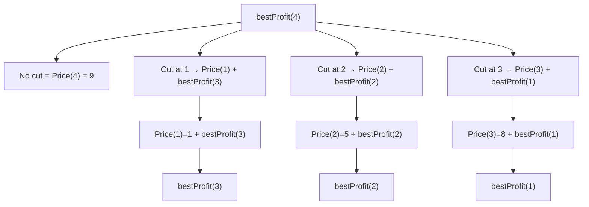

# Problem 4 - Rod Cutting Problem

    Solution by Victor Correa
    Time spend on this activity: 3h20min
    Completed on 06th September 2025

## Problem Description

You are given a rod of length $n$ and a table of prices for each piece. Determine the maximum revenue that can be obtained by cutting up the rod into smaller pieces.

As an example, consider a rod with length = 4 that follows a price table per length:

| Rod Length | Price |
| :--------: | :---: |
|      1     |   1   |
|      2     |   5   |
|      3     |   8   |
|      4     |   9   |

We want the **maximum profit** possible, so let's consider the following possibilities:

1. No cut
    - Use the full rod (length = 4) where the price is defined by Price(4) = 9

2. Cut into len = 1 and len = 3, thus total len = 4.
    - Price(1) + Price(3) = 1 + 8 = 9 

3. Cut into len = 2 + len = 2, thus total len = 4
    - Price(2) + Price(2) = 5 + 5 = 10

4. Cut into len = 1 + len = 1 + len = 2, thus total len = 4
    - Price(1) + Price(1) + Price(2) = 1 + 1 + 5 = 7

5. Cut into len = 1 + len = 1 + len = 1 + len = 1, thus total len = 4
    - Price(1) + Price(1) + Price(1) + Price(1) = 1 + 1 + 1 + 1 = 4

It's clear that the **best choice** is option 3, where we cut the rod into two pieces of length 2 and got the maximum revenue of 10. A *recursion tree* for this problem:



Some **hints** for solving this issue are:

Think wisely, if we cut the rod at position ```i```, what is the total value? We need to explore all cut positions, then take the maximum revenue from it. Start working on a solution for smaller rods first and them escalate for a bigger problem.

### Approach

Solve it for a rod with length = 10 with the following table prices:

| Rod Length | Price |
| :--------: | :---: |
|      1     |   1   |
|      2     |   5   |
|      3     |   8   |
|      4     |   9   |
|      5     |   10  |
|      6     |   17  |
|      7     |   17  |
|      8     |   20  |
|      9     |   24  |
|     10     |   30  |

## Solution

To start working with this solution, first we will create a class Rod with the following attributes: length and price per length and as getter methods, one for fetching the length and other for the price. This will keep a certain level of abstraction for the object rod that will help a lot with tests and debugging.

### Class Rod

Let's define the class with the attributes length and price, and also two getter methods ```getLength``` and ```getPrice```:

```py
class Rod(object):
    def __init__(self, length, price):
        self.length = length
        self.price = price

    #Getter Methods
    def getLength(self):
        return self.length
    
    def getPrice(self):
        return self.price
    
    def __str__(self):
        return 'Rod len(' + self.length + '), price = ' + self.price
    
    def __repr__(self):
        return self.__str__()
```

### Builder rod function

We need a function to build the object rod based on two lists: one with rod's length and other with the prices for each length:

```py
def buildRod(length, price):
    """ Assumes length, price are lists
    returns rod : list of each rod's length containing:
    [length, price] """
    rod = []

    for i in range(len(length)):
        rod.append(Rod(length[i], price[i]))

    return rod
```

### Explore all possible cuts

Since the input is already indexed by rod length when we create the object Rod, each price corresponds to a specific length in the following way: ```Price(i) = price of rod on len i```. So we need to explore every possible first cuts in the following way:

For each rod of length $n$:
- No cut: ```Price(n)``` to be considered
- First cut at ```i``` implies that ```Price(i) + bestProfit(n - i)```
- We keep computing this for ```i = 1 ... n - 1``` (Combinatorial Exploration)

We can use a recursive function ```bestProfit``` that will return the best revenue for a rod of length $n$ based on the price. Let's use $n$ as the problem size (rod's length) and we can call our function using n and also the rod itself like ```bestProfit(n, rod)```

```py
def bestProfit(n, rod):
    """ Assumes n an integer (n is total size of rod) and rod is a list of Rod objects
    Returns the best revenue for a rod of length n based on each length's price in form of a tuple (price, cuts)"""

    # If we make no cut - Base case
    if n == 0:
        return 0, [] # Empty list, no cut was made

    maxProfit = 0
    bestCuts = [] 

    # Let's try all cut's of length i
    for i in range(1, n + 1):
        remainingProfit, remainingCuts = bestProfit(n - i, rod)

        profit = rod[i - 1].getPrice() + remainingProfit

        cuts = [i] + remainingCuts

        # To keep a track of the best option profit x cuts
        if profit > maxProfit:
            maxProfit = profit
            bestCuts = cuts

    return maxProfit, bestCuts
```

We are using ```n == 0``` as the base case for when no cuts are made in the rod, the recursive call of ```bestProfit(n - i, rod)``` ensures we are exploring each possible first cut of size ```i``` and we are getting the maximum profit using the ```max()``` function. We are checking ```rod[i - 1]``` because our list is zero indexed, since we are using the range from $1$ to $n + 1$, this ensure we consider every item in the list.

We are calling it recursively for smaller lengths like $n -1$, so in our first example for a rod with len = 4:

1. Cut 1 + bestProfit(4 - 1)
2. Cut 2 + bestProfit(4 - 2)
3. Cut 3 + bestProfit(4 - 3)
4. Cut 4 + bestProfit(4 - 4) (we are using the whole piece, no cut here, ending the recursive call)

Note: The ```max()``` function returns the largest item in an iterable, or the item with the highest value of two or more arguments.

We also want to keep track of the best option for profit x cuts, for that we can store each operation in the following way, if the calculated profit is greater than the maxProfit (previously calculated) then we can store the new profit and also which cuts were made to get it.

### Notes about this algorithm

We can check that this algorithm is working and selecting the best choice of profit x cuts, but what about efficiency? We are calling this algorithm recursively for each cut to solve ```bestProfit(n - i, rod)``` such that a lot of repetition is coming up, for instance: if we want to solve ```bestProfit(5)``` we have to call ```bestProfit(4), (3)``` multiple times as shown in the diagram bellow. So our current algorithm has a **overlapping subproblem** with exponential time complexity, the order of complexity of our current algorithm is O($2^n$). In our example, for a rod of length n = 4, it means that $2^4 = 16$, if we have a rod of length 10 $2^10 = 1024$, which aren't that big yet and we can compute them fine. But what if we have a rod of length 100? Then $2^100$ becomes practically impossible to solve this issue.

Let's take a look when solving it for a rod of len = 5:

```mermaid
graph TD
    A["bestProfit(5)"] --> B1["cut 1 → bestProfit(4)"]
    A --> B2["cut 2 → bestProfit(3)"]
    A --> B3["cut 3 → bestProfit(2)"]
    A --> B4["cut 4 → bestProfit(1)"]
    A --> B5["cut 5 → bestProfit(0)"]

    %% Expanding bestProfit(4)
    B1 --> C1["cut 1 → bestProfit(3)"]
    B1 --> C2["cut 2 → bestProfit(2)"]
    B1 --> C3["cut 3 → bestProfit(1)"]
    B1 --> C4["cut 4 → bestProfit(0)"]

    %% Expanding bestProfit(3)
    B2 --> D1["cut 1 → bestProfit(2)"]
    B2 --> D2["cut 2 → bestProfit(1)"]
    B2 --> D3["cut 3 → bestProfit(0)"]

    %% Expanding bestProfit(2)
    B3 --> E1["cut 1 → bestProfit(1)"]
    B3 --> E2["cut 2 → bestProfit(0)"]

    %% For the overlapping subproblems: highlight
    style C1 fill:#ffcccc,stroke:#ff0000,stroke-width:2px
    style D1 fill:#ffcccc,stroke:#ff0000,stroke-width:2px
    style B3 fill:#ffcccc,stroke:#ff0000,stroke-width:2px

    style C2 fill:#ffcccc,stroke:#ff0000,stroke-width:2px
    style D2 fill:#ffcccc,stroke:#ff0000,stroke-width:2px
    style E1 fill:#ffcccc,stroke:#ff0000,stroke-width:2px

    %% Base cases
    B5:::base
    C4:::base
    D3:::base
    E2:::base

    classDef base fill:#ccffcc,stroke:#008000,stroke-width:2px;
```



We can check it's solving the same problem for ```bestProfit(1), (2), (3)```multiple times, so we could store each result of ```bestProfit()``` and before doing the calculation, check if we've already calculated it and use this value.

Our current problem has the two aspects necessary for using **dynamic programming** techniques to solve it in the most efficient way: **overlapping subproblems** (as we checked that it calls the same problem it already solved multiple times) and also **optimal substructure** because we're trying to find the best solution by combining smaller optimal solutions.

### Implementing using memoization technique

Let's build a dictionary called ```memo``` to keep track of each calculation performed by ```bestProfit```. In this way, whenever we want to call the recursion for a specific length of rod ```n```, first we check if we have already calculate the best revenue for ```n```. If it's not stored in ```memo```, then we can compute the best profits and cuts, then store it for future reference. We keep the dictionary in the following way:

```memo[n] = (maxProfit, bestCuts)```

Such that when we finish the calculation loop for a length of $n$, we find the best profit and cuts possible which will be the tuple ```(maxProfit,bestCuts)``` and associates with $n$ which will be the dictionary's key.

The implementation for this version of ```bestProfit``` will be called ```bestProfitOptimized``` and will have the following structure:

```py
def bestProfitOptimized(n, rod, memo = {}):
    """ Assumes n an integer (n is total size of rod) and rod is a list of Rod objects
    Returns the best revenue for a rod of length n based on each length's price in form of a tuple (price, cuts)"""

    # If we make no cut - Base case
    if n == 0:
        return 0, [] # Empty list, no cut was made

    # Variables initialization
    maxProfit = 0
    bestCuts = [] 

    # Check if it already calculated for len = n
    if n in memo:
        return memo[n]

    else:
        for i in range(1, n + 1):
            remainingProfit, remainingCuts = bestProfitOptimized(n - i, rod, memo)

            profit = rod[i - 1].getPrice() + remainingProfit

            cuts = [i] + remainingCuts

            # To keep a track of the best option profit x cuts
            if profit > maxProfit:
                maxProfit = profit
                bestCuts = cuts

        # Store maxProfit and bestCuts in memo for each key n
        print(f"n = {n} final")
        memo[n] = (maxProfit, bestCuts)

    return memo[n]
```

### Overall Complexity for this solution

While the first version of ```bestProfit```, which does not rely on the advantage of memoization has a exponential overall complexity of O($2^n$), by using memoization resource it's the algorithm runs much faster even for larger numbers (when length of rod reaches high levels) because we compute each problem only **once**.

TODO: Need to finish up this complexity analysis for second version.

## Conclusion

Need to finish writing the conclusion for this problem too


