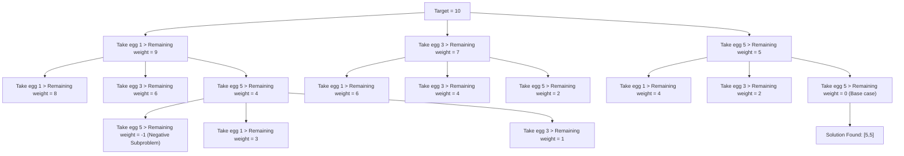
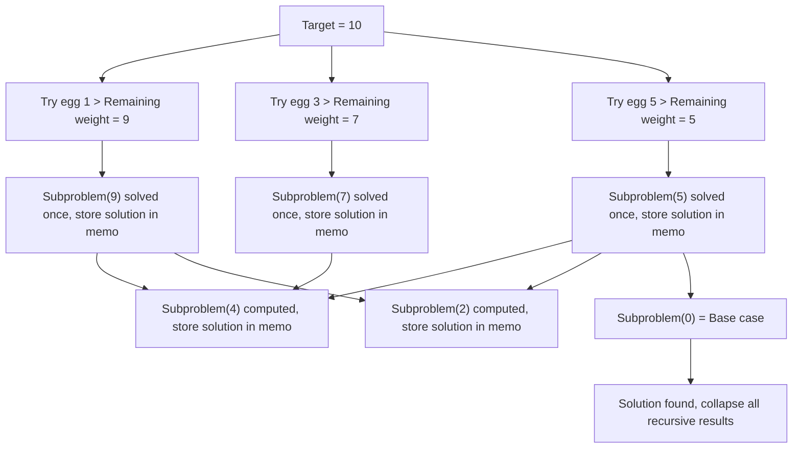

# Problem Set 1.B - Golden Eggs

    Solution by Victor Correa
    Time spend on this activity: 4 hours 30 minutes
    Completed on 14th September 2025


After the Aucks transport the cows, one of their interns finds flocks of golden geese. Due to budget cuts they are forced to downsize their ships so they can’t simply take the geese back, but instead decide to take their golden eggs back. Their ships can only hold a certain amount of weight, and are very small inside. So, because all the eggs are the same size, but have different 5 weights, they want to bring back as few eggs as possible that fill their ship’s weight limit. Golden eggs are all the same size, but may have different densities, thus 1 two-pound egg is better than 2 one-pound eggs.

## Problem B.1: Dynamic Programming: Hatching a Plan

The Aucks want to carry as few eggs as possible on their trip as they don’t have a lot of space on their ships. They have taken detailed notes on the weights of all the eggs that geese can lay in a given flock and how much weight their ships can hold. We need to implement a **dynamic programming algorithm** to **find the minimum number of eggs needed to make a given weight for a certain ship** in ```dp_make_weight```. The result should be an integer representing *the minimum number of eggs from the given flock of geese needed to make the given weight*. Our algorithm does not need to return what the weight of the eggs are, just the minimum number of eggs.

**Notes:**

- We may implement our algorithm using the top-down recursive method or the bottom-up 
tabulation method. The former was covered in lecture, but either method is accepted. 

- The *memo* parameter in ```dp_make_weight``` is optional. We may or may not need to use 
this parameter depending on implementation.

**Assumptions:**

- All the eggs weights are unique between different geese, but a given goose will always lay the same size egg

- They can wait around for the geese to lay as many eggs as they need.

**Example**

Suppose the first ship can carry 99 pounds and uses the first flock of geese they find, which contains geese that lay eggs of weights 1, 5, 10, and 20 pounds.

Our dynamic programming algorithm should return 10 (the minimum number of egg needed to make 99 pounds is 4 eggs of 20 pounds, 1 egg of 10 pounds, 1 egg of 5 pounds, and 4 eggs of 1 pound).

**Hint Question:**

Dynamic programming involves breaking a larger problem into smaller, simpler subproblems, solving the subproblems, and storing their solutions. What are the subproblems in this case? What values do we want to store?

We are supposed to find the *smallest number of eggs needed to make the target weight*, so the first thought would be: for each egg of weight *w*, we need to find the maximum value for these eggs to go on the ship.

For instance: if eggs are 1, 2 and 4 weight and the capacity is 20:

We begin our test for the heaviest of them, which is 4:

    1. We get one egg and check the total weight of the selected egg + 1:
        Is total weight + 1 greater or equal than limit?
            If yes:
                return the amount of eggs with weight w
                stop
            If not:
                iterate: total weight + egg weight
                iterate: amount of selected eggs of weight w
                keep selecting 4 eggs until reach limit

    2. Repeat this process for each size n + 1 until we get the weight limit


But this is a **greedy approach**, we are told explicitly to use **dynamic programming** to solve this issue. Therefore we need to find a better solution.

We can develop a solution to this problem by following a sequence of 4 steps (*Introduction to Algorithms*, by Thomas H. Cormen, Charles E. Leiserson, Ronald L. Rivest, Clifford Stein):

    1. Characterize the structure of an optimal solution
    2. Recursively define the value of an optimal solution
    3. Compute the value of an optimal solution (in a bottom-up fashion for instance)
    4. Construct an optimal solution from computed information

The structure of an optimal solution for the egg storage problem is to think what are the **subproblems** we need to solve. So it's a good idea to consider the final question we are trying to answer also be the subproblem. Thus **what are the minimum amount of eggs that can produce the weight W?**.

If this was our subproblem, what would be a recursive way to solve it? We are going to use a function called ```dp_make_weight(egg_weights, target_weight, memo = {})``` represents the minimum number of eggs required for a ```target_weight```. We can check that our base case is the minimum amount of eggs that will produce a target weight of zero, hence zero eggs equals target weight zero. A **general subproblem** can be minimum number of eggs S (for $S > 0$).

### Implementation for B.1 - Dynamic Programming:

First let's take a look on a **brute force** method for this problem:

Assumes eggs of size ```egg_weights = (1, 3, 5)``` and maximum capacity of ship is ```target_weight = 10```. Then ```dp_make_weight(egg_weights, target_weight) = ?```.

If we want to get to the target weight of 10, we can do that by choosing any egg. If we choose an egg of weight 5, we have one egg selected and the remaining capacity of ship is a problem for a weight = 5. If we choose an egg of weight 3, then we have one egg 3 and the remaining capacity is a problem for a weight = 7. We keep doing this until we get to our base case for target weight = 0.



For each node in the tree, we try all possible eggs and take the best solution. Hence the recursive solution can be defined as: minimum eggs for ```target_weight = zero``` if ```egg_weights``` is zero, or we take the best solution after choosing all possible eggs for ```target_weight > 0```.

```py
def dp_make_weight(egg_weights, target_weight):
    # Base case
    if target_weight == 0:
        numEggs = 0
    
    # Recursive call
    else:
        numEggs = None

        for egg in egg_weights:

            remainingWeight = target_weight - egg

            # This step is necessary to skip when the algorithm tries to reach the target_weight
            # from a negative subproblem
            if remainingWeight < 0:
                continue
            
            # minIgnore is a helper function to ignore negative subproblems, because some subproblems does not have a solution
            numEggs = minIgnore(numEggs, dp_make_weight(egg_weights, remainingWeight) + 1)
    
    return numEggs
```

**Note for the helper function ```minIgnore```**:

Suppose we have a ```remainingWeight = 3```, the algorithm will try to solve using an egg of weight 5, which will result in $-2$. To ignore this subproblem we use the following piece of code:

```py
# This step is necessary to skip when the algorithm tries to reach the target_weight from a negative subproblem
if remainingWeight < 0:
    continue
```

We are using the helper function ```minIgnore``` because we are exploring different options for using eggs in the recursive calls. Some recursive calls won't sense (for instance when the remaining weight goes negative). In those cases, we don’t want to consider their result, so we can represent these results with ```None```.

This ```minIgnore``` function is basically checking that:

1. If one of the candidates is ```None```, ignore it.

2. If both are valid, return the smaller one.

3. If neither is valid, return ```None``` again.

This function will keep our algorithm clean from invalid subproblems and allow to compare valid results, it has the following implementation:

```py
def minIgnore(a, b):
    """ Assumes a, b are integers or None

    Returns int: the smaller valid integer 
    between a and b. Or None if both of them are None"""

    # Check if a is invalid
    if a is None:
        return b

    # Check if b is invalid
    if b is None:
        return a
    
    # If both are integers, returns the smallest one
    return min(a, b)
```

Why the **brute-force** is not the best option?

By running this algorithm we can see how slow it is, takes a long time compute for ```len(egg_weights) = 5``` because the **brute force** method explores every branch until ```remainingWeight = 0```, repeating a lot of subproblems (for instance ```RemainingWeight = 4``` appears in many branches). 

At each recursive call, our algorithm is branching into as many options as there are egg weights. The maximum recursion depth is the target_weight because in the worst-case we are subtracting 1 each time. Hence the complexity for the brute force approach is approximately O($E^w$) (*Exponential Grow*) where $E$ the amount of different egg weights we have and $w$ is the target weight.

We can use *memoization* to speed it up by storing each computation and returning it if already solved. We just need to first check if for the current target_weight the calculations had been already done. If yes we return it's value, if not we can continue to calculate it and store it right after. By introducing memoization for this algorithm:

```py
def dp_make_weight(egg_weights, target_weight, memo = {}):
    """ Assumes egg_weights - tuple of integers, available egg weights sorted from smallest to largest value (1 = d1 < d2 < ... < dk)
    target_weight - int, amount of weight we want to find eggs to fit
    memo - dictionary, parameter for memoization
    
    Returns: int, smallest number of eggs needed to make target weight"""
    
    # If already calculated for target weight, return it
    if target_weight in memo:
        return memo[target_weight]
    # Base case
    if target_weight == 0:
        numEggs = 0
    
    # Recursive call
    else:
        numEggs = None

        for egg in egg_weights:

            remainingWeight = target_weight - egg

            if remainingWeight < 0:
                continue
            
            # minIgnore is a helper function to ignore negative subproblems, because some subproblems does not have a solution
            numEggs = minIgnore(numEggs, dp_make_weight(egg_weights, remainingWeight) + 1)
    
    #Store the numEggs calculate for target_weight in memo
    memo[target_weight] = numEggs
    return numEggs
```

Now we can check that the algorithm is really faster, let's check the graph for this approach and see how many recomputation we have avoided in this approach:



Since memoization avoids recomputation, we are only calculating each subproblem once, which means we will have a much better complexity of O(```len(egg_weights) * target_weight```).

## Problem B.2: Writeup

1. Explain why it would be difficult to use a brute force algorithm to solve this problem if there were 30 different egg weights. You do not need to implement a brute force algorithm in order to answer this. 

Since the brute force approach has an exponential complexity, our algorithm would scale quickly to a complexity of O($30^w$) where w is the ```target_weight```, making it really difficult to solve it using a brute force algorithm.

2. If you were to implement a greedy algorithm for finding the minimum number of eggs needed, what would the objective function be? What would the constraints be? What strategy would your greedy algorithm follow to pick which eggs to take? You do not need to implement a greedy algorithm in order to answer this. 

Already answered the **greedy approach** on the problem description, to have a base for implementing the DP one.
